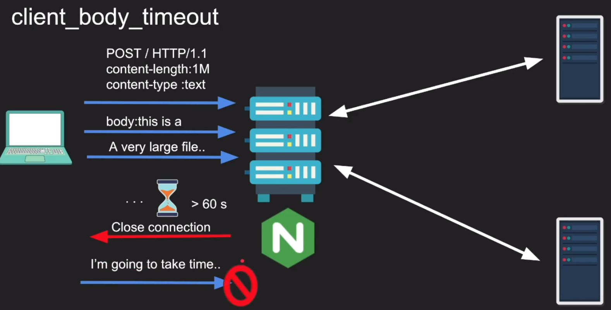
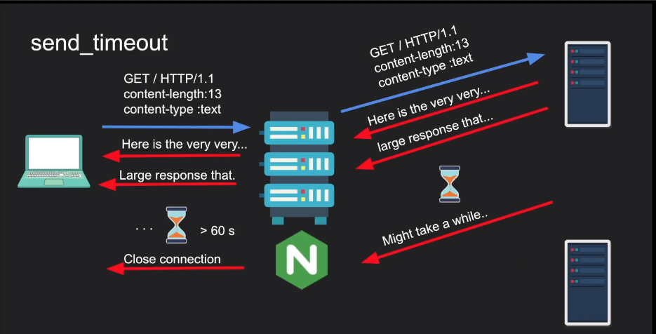
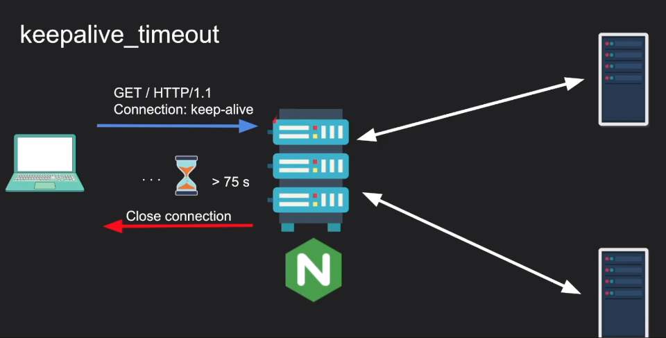
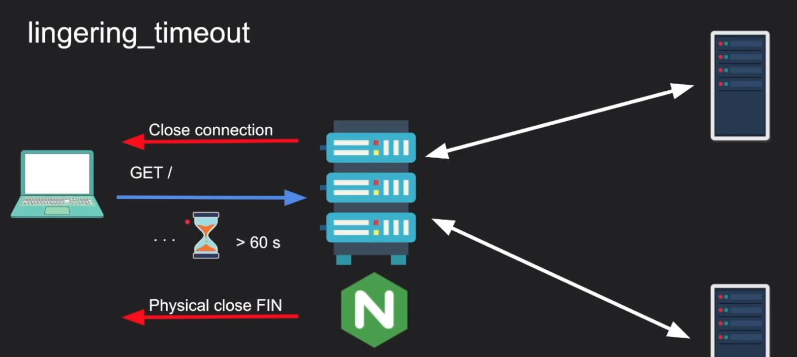
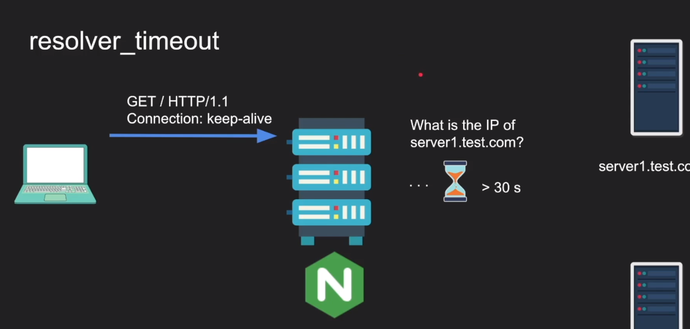
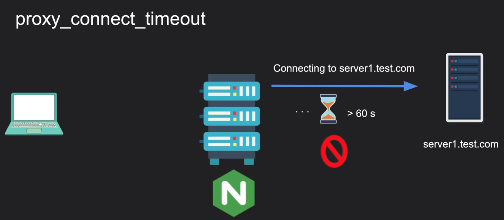
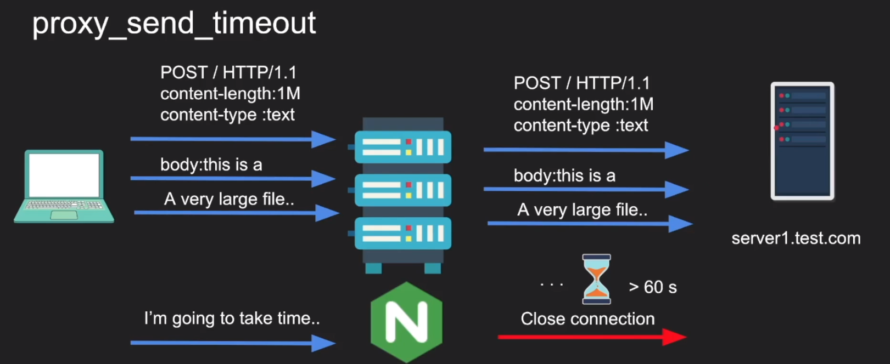
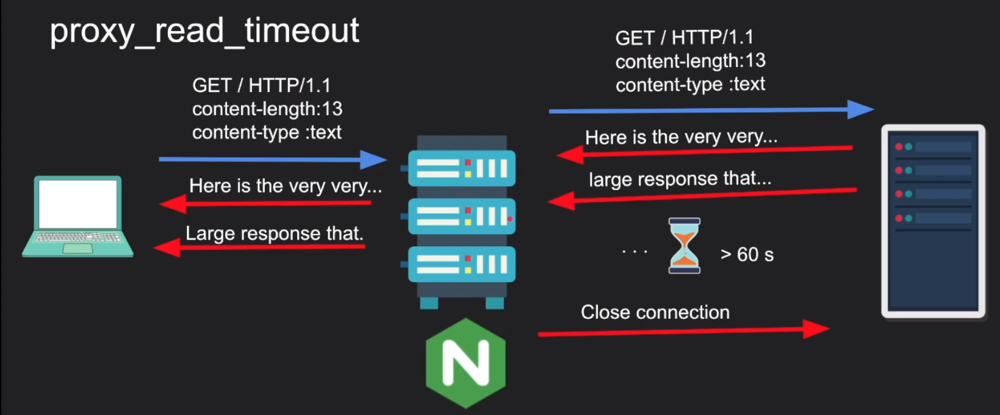
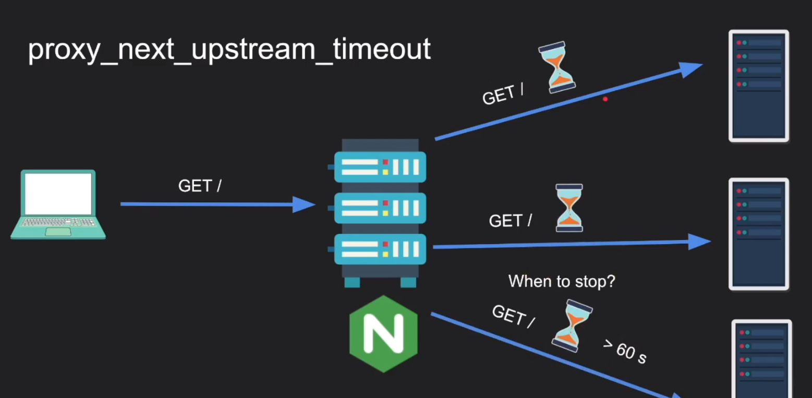
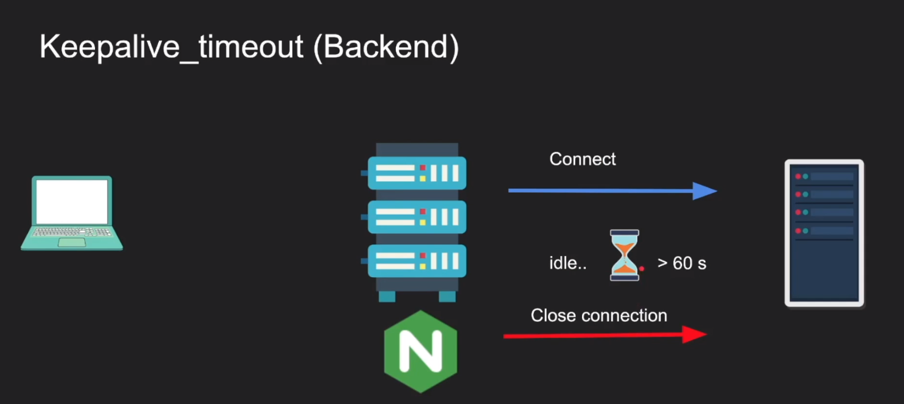

# NGINX TIMEOUT

### frontend timeouts: client talks to NGINX
```
- client_header_timeout
- client_body_timeout
- send_timeout
- keepalive_timeout
- lingering_timeout
- resolver_timeout
```

### backend timeouts: NGINX talks to backend
```
- proxy_connect_timeout
- proxy_send_timeout
- proxy_read_timeout
- proxy_next_upstream_timeout
- keepalive_timeout_backend
```

# 1. FRONTEND TIMEOUT:

#### 1.1 client_header_timeout:
```
Defines a timeout for reading client request header. If a client does not transmit the entire header within this time, the request is terminated with 408 (Request time-out). Default 60s
```


#### 1.2 client_body_timeout:
```
Defines a timeout for reading client request body. The timeout is set only for a period between to successive read operations, not for the transmission whole request body. If a client does not transmit anything within this time, the request is terminated with the 408 (Request time-out). Default 60s
```


#### 1.3 send_timeout

```
Sets is timeout for transmitting a response to the client. The timeout is a set only between two successive write operations, not for the transmission of the whole response. if the client does not receive anything within this time, the connection is close (Default 60s)
```


#### 1.4 keepalive_timeout:
```
keepalive_timeout is the time where the server will keep an idel connection open. if you sen a request and the do nothing on this connection, the server will shutdown the connection at 75s after your previous request (default 75s)
```


#### 1.5 lingering_timeout:
```
This directive defines the number of time that Nginx should wait between two read operations before closing the client connection. Default value: 5 seconds
```


#### 1.6 resolve_timeout:


```
resolve_timeout sets how long NGINX will wait for answer from resolver (DNS).

valid flag means how long NGINX will consider answer from resolver as valid and will not ask resolver for that period.

http {
  resolver 172.17.42.1 valid=600s;
  resolver_timeout 60s;
}

In your example, let's say NGINX want to resolve example.com. It will ask resolver (172.17.42.1) and if resolver doesn't answer within 60 seconds NGINX will fail this request (and probably show you 500 error). Let's say resolver successfully answered, then NGINX will remember that answer for 10 minutes. If NGINX needs to resolve example.com within that time, then it will use previous answer instead of asking resolver again
```



# 2. BACKEND TIMEOUT:

### 2.1 proxy_connect_timeout
```
Defines a timeout for establishing a connection with a proxy server. it should be noted that this timeout cannot usually exceed 75 seconds
```




### 2.2 proxy_send_timeout
```
Sets a timeout for transmitting a request to the proxied server. The timeout is set only between two successive write operations, not for the transmission of the whole request. If the proxied server does not receive anything within this time, the connection is closed.
```


### 2.3 proxy_read_timeout
```
Defines a timeout for reading a response from the prorxied server. The timeout is set only between 2 successive read operations, not for the transmission of the whole response. If the proxied server does not transmit anything within this time, the connection is close
```



### 2.4 proxy_next_upstream_timeout
```
limits the time during which a request can be passed to the next  server. the 0 value turn off this limitation. Default 0
```



### 2.5 keepalive_timeout_backend
```
Sets a timeout during which an idle keepalive connection to an upstream server will stay open
```
