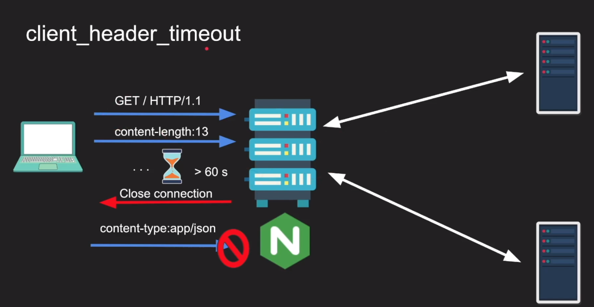

# NGINX TIMEOUT

### frontend timeouts: client talks to NGINX
```
- client_header_timeout
- client_body_timeout
- send_timeout
- keepalive_timeout
- lingering_timeout
- resolver_timeout
```

### backend timeouts: NGINX talks to backend
```
- proxy_connect_timeout
- proxy_send_timeout
- proxy_read_timeout
- keepalive_timeout
- proxy_next_upstream_timeout
```

### Detail frontend timeouts:

#### client_header_timeout:
```
Defines a timeout for reading client request header. If a client does not transmit the entire header within this time, the request is terminated with 408 (Request time-out). Default 60s
```



#### client_body_timeout:
```
Defines a timeout for reading client request body. The timeout is set only for a period between to successive read operations, not for the transmission whole request body. If a client does not transmit anything within this time, the request is terminated with the 408 (Request time-out). Default 60s
```
