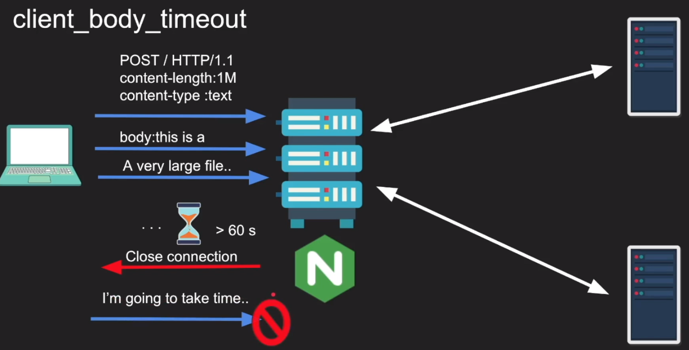
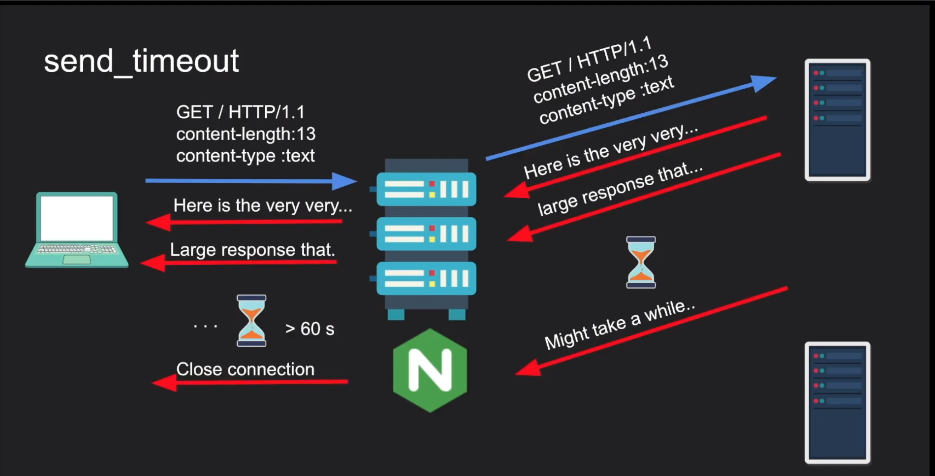

# NGINX TIMEOUT

### frontend timeouts: client talks to NGINX
```
- client_header_timeout
- client_body_timeout
- send_timeout
- keepalive_timeout
- lingering_timeout
- resolver_timeout
```

### backend timeouts: NGINX talks to backend
```
- proxy_connect_timeout
- proxy_send_timeout
- proxy_read_timeout
- keepalive_timeout
- proxy_next_upstream_timeout
```

### 1. Detail frontend timeouts:

#### 1.1 client_header_timeout:
```
Defines a timeout for reading client request header. If a client does not transmit the entire header within this time, the request is terminated with 408 (Request time-out). Default 60s
```


#### 1.2 client_body_timeout:
```
Defines a timeout for reading client request body. The timeout is set only for a period between to successive read operations, not for the transmission whole request body. If a client does not transmit anything within this time, the request is terminated with the 408 (Request time-out). Default 60s
```


#### 1.3 send_timeout

```
Sets is timeout for transmitting a response to the client. The timeout is a set only between two successive write operations, not for the transmission of the whole response. if the client does not receive anything within this time, the connection is close (Default 60s)
```


#### 1.4 keepalive_timeout:
```
keepalive_timeout is the time where the server will keep an idel connection open. if you sen a request and the do nothing on this connection, the server will shutdown the connection at 75s after your previous request (default 75s)
```

